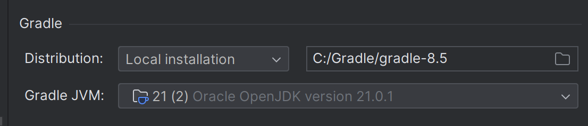

# Лучшее приложение для кинотеатров в галактике

Это приложение представляет собой систему управления кинотеатром, построенную на Kotlin, использующую Gradle в качестве
инструмента сборки.

## Предварительные условия

Перед началом работы убедитесь, что вы выполнили следующие требования:

* У вас установлена 21 версия Java и 1.9.21 Kotlin.
* У вас установлена версия Gradle 8.5.
* У вас установлена InteljIDE.

Запуск гарантирован при следующих настройках Buider:


## Установка приложения

Чтобы установить приложение, выполните следующие действия:

1. Клонируем репозиторий: `git clone https://github.com/yourusername/your-repo-name.git`
2. Переходим в каталог проекта: `cd your-repo-name`

## Запуск приложения

Чтобы использовать приложение AppCinema, выполните следующие действия:

1. Откройте проект в вашей любимой InteljIDE .
2. Запустите MainKt `Shift + F10`, предварительно открыв его .

## Пояснения к проекту

Предвавительно рекомендую ввести Program Arguments в Run/Debug Configurations, чтобы не
вводить их каждый раз при запуске приложения.

Program Arguments: `"src\main\resources\films.json src\main\resources\sessions.json src\main\resources\tickets.json"`

Это файлы в которых по умолчанию хранятся данные о фильмах, сеансах и билетах соответственно.

Однако можно передать и свои, как через Program Arguments, так и через консоль.

После запуска приложения
вы увидите список команд доступных к выполнению.
Выберите команду, введя ее номер и нажав Enter.

```
1. View seats
2. Buy tickets
3. Return tickets
4. Edit film
5. Edit sessions
6. Mark a visit
7. View all films
8. View all sessions
9. Add Film
10. Add Session
11. Delete Film
12. Delete Session
13. Exit
```

После выбора команды, вам будет предложено ввести необходимые данные для ее выполнения. Они четко описаны в консоли.

```
Enter film name:
Enter session date and time (yyyy-MM-dd HH:mm): 
etc.
```

При отображении мест на сеансе вы увидите следующую картину:
```
[X] [O] [O] [O] [O] [O] [O] [O] [O] [O]
[O] [O] [O] [O] [O] [O] [O] [O] [O] [O]
[O] [O] [O] [O] [O] [O] [O] [O] [O] [O]
```
Где X - место, которое уже куплено, а O - свободное место.

При брони места, учтите, что места необходимо указывать не ряд и место, а просто номер места от 1 до 30.
Места нумеруются слева направо, сверху вниз.

Введя при выборе `3 4` -- вы осуществите выбор билета на 4 и 3 место сразу.

## Архитектура проекта

Проект состоит из пакетов:

* `presentation` - содержит классы, необходимые для работы с пользовательским интерфейсом.

`CinemaController` отвечает за взаимодействие с пользоваелем, ввод и вывод данных, корректный вывод ошибок.
Данный класс использует `CinemaService` для выполнения команд пользователя (о нем позже).
Так же вспомогательными классами в presentation являются `InputHandler` и `NotificationHandler`, отвечающие за ввод
данных и
уведомления пользователя о корректном выполнении операций.

----

* `model` - содержит основные классы, необходимые для работы приложения (Film, Session, Ticket).
  Все сущности связаны между собой по id, что позволяет легко находить их с помощью `Services`.

Небольшое пояснение к свойствам класса:

`Ticket:
var isVisited : Boolean = false` - отвечает за реальное посещение сеанса, по умолчанию false. Это поле необходимо для
пункта 5 функциональных требований.

`Session:
val seatsNumber: Int = 30` - количество мест в зале, по умолчанию 30. Всего 3 ряда по 10 мест.

`Film:
val rentalDates: Pair<Date, Date>` -- даты проката фильма

---- 

* `service` - содержит классы, необходимые для работы с данными.

`CinemaServiceImpl` - основная сущность, отвечающая за запрос данных из 3х хранилищей JSON.
Соблюдая принципы SOLID, данный класс использует 3 сервиса для работы с каждым хранилищем отдельно.
А так же наследуется от 3х интерфейсов (`CinemaAdminService, CinemaClientService, CinemaService`), что позволяет легко
заменять реализацию сервисов (принцип O).

`CinemaAdminService` - содержит методы для работы с фильмами и сеансами (добавление, удаление, редактирование).

`CinemaClientService` - содержит методы для работы с билетами (покупка, возврат, просмотр).

`CinemaService` - содержит методы для просмотра данных (фильмы, сеансы, места в зале).

`FilmServiceImpl, SessionServiceImpl, TicketServiceImpl`  реализуют интрефейсы по работе с репозиториями (поиск по
имени, времени и тп, отправляют запрос в репозиторий на добавление, удаление, обновление данных).

`BaseService<T>` - базовый интерфейс, содержащий методы для работы с репозиторием.


----

* `repository` - содержит классы, необходимые для работы с файлами.

`Repository<T>` - интерфейс, содержащий методы для работы с файлами (добавление, удаление, обновление данных).

`JsonRepository<T>` - реализует интерфейс `Repository` и содержит методы для работы непосредственно с JSON файлами.

T - это класс, список которого хранится в файле (Film, Session, Ticket).

----

* `utils` - содержит вспомогательные классы.

`object ExceptionHandler` - отвечает за обработку исключений, возникающих во время исполнения

`StringExtensions` - содержит метод для работы со строкой вывод (для красивого вывода в консоль)

----

## Почему JSON?

+ Лаконичнее и читабельнее чем XML и CSV.

+ JSON поддерживает иерархическую структуру, позволяя представлять сложные структуры данных (массивы, объекты, вложенные объекты), не требуя предварительно определенной схемы.

+ JSON поддерживается большинством языков программирования. В данном проекте использована библиотека Gson, которая позволяет легко преобразовывать JSON в объекты и наоборот.

Я думаю этого более чем достаточно, чтобы использовать JSON в данном проекте.

# Диаграммы

Лежат в папке `\diagrams`

